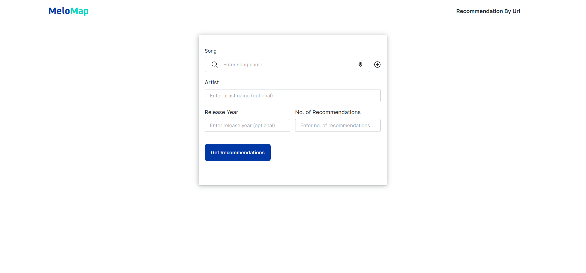
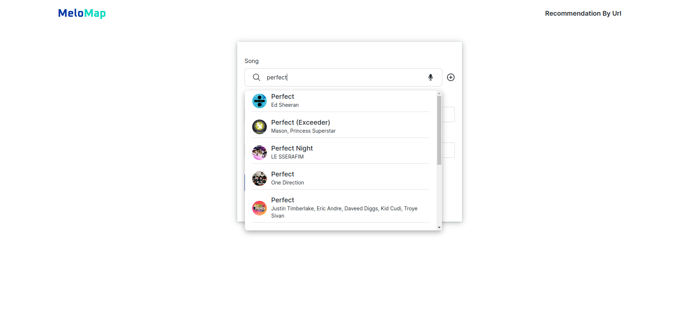
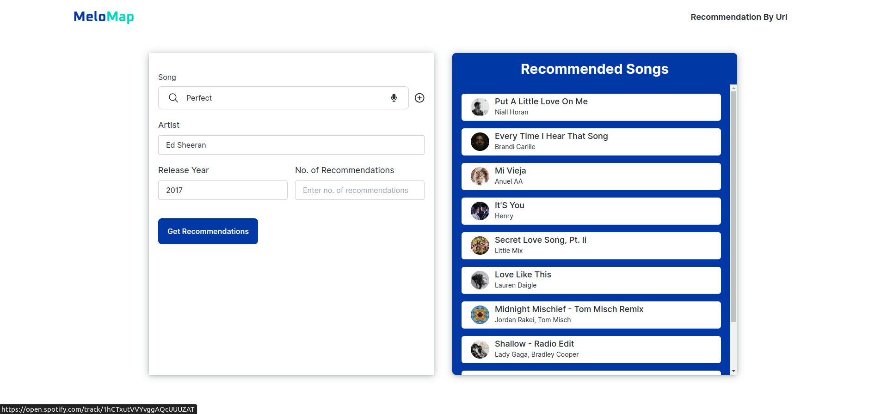
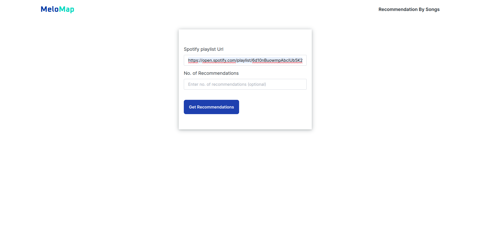
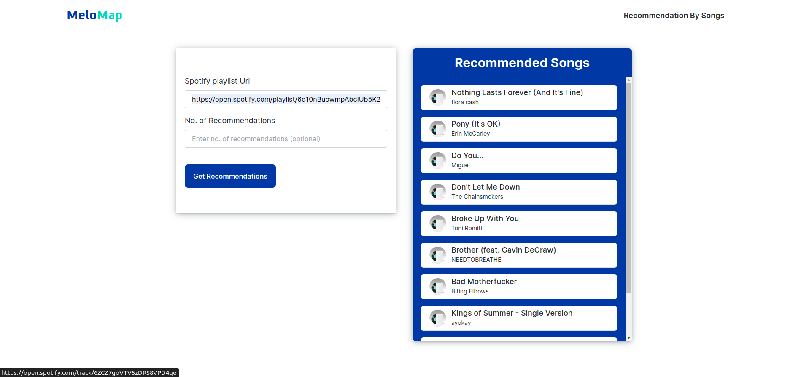

# Song Recommendation System

Welcome to the Song Recommendation System! This project aims to recommend songs based on user input using data from the Spotify API. By leveraging K-means clustering and cosine similarity, users can receive personalized song recommendations either by providing individual songs or a playlist URL.

## Table of Contents

- [Introduction](#introduction)
- [Features](#features)
- [Installation](#installation)
- [Usage](#usage)
- [Technologies Used](#technologies-used)

## Introduction

MeloMap is a web application that recommends songs to users based on their input. It utilizes machine learning models trained on Spotify's song data to generate recommendations.

## Features

- Users can input a song name, artist and year or a playlist Url to receive song recommendations.
- Recommendations are based on the input song's features and similarities to other songs in the dataset.
- The application provides recommendations in real-time using the data from Spotify API.

## Installation

1. Clone the repository:

 
2. Navigate to the project directory:

  
3. Run Docker:

    To start the application, run the following command:

   
2. Visit the following url in your browser to access the application:

 

## Usage

To use the application, follow the instructions below:

1. **Recommendation by Song**:

   - Search the song

   - Select the song, enter the number of recommendations(optional), then click on Get Recommendations

    

   - Click on the recommended song to listen it on spotify

     

2. **Recommendation by Url**:

   - Enter spotify playlist url, enter the number of recommendations(optional), then click on Get Recommendations
     
     

   - Click on the recommended song to listen it on spotify
      
    

   

## Technologies Used
- Django: Backend framework for handling requests and data processing.
- React: Frontend library for building user interfaces.
- Spotify API: Provides access to song data for recommendations.
- Python: Programming language used for backend development and for creating recommendation model.
- JavaScript: Programming language used for frontend development.
- Docker: Containerization platform for packaging the application and its dependencies.

<!-- 
## Documentation

For detailed documentation, including class descriptions and methods, please refer to [Notion Documentation](https://occipital-elm-10d.notion.site/MananTakkar_Song-Recommendation-System-dfc0b614d4554783893d28592d8c36db?pvs=4). -->

<!-- 
## License
This project is licensed under the [MIT License](LICENSE). See the [LICENSE](https://github.com/manantakkar18/Song-Recommendation-System/blob/main/LICENSE.txt) file for details. -->
"# Song-recommendation" 
